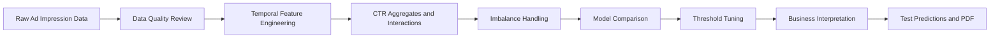

<p align="center">
  
</p>

# Ad Click Prediction

An end-to-end machine learning case study that predicts rare ad clicks from
user, product, campaign, webpage, and temporal context. The project turns an
imbalanced digital-advertising dataset into business-ready CTR insights,
model comparisons, test predictions, and a compact submission PDF.

[](https://www.python.org/)
[](https://scikit-learn.org/)
[](https://xgboost.readthedocs.io/)
[](https://pandas.pydata.org/)
[](ad_click_prediction_case_study.ipynb)
[](reports/ad_click_prediction_case_study_submission.pdf)
[](https://github.com/banshiAbp/ad-click-prediction/commits/main)

> **Verified outcome:** After correcting target leakage and separating threshold
> tuning from final holdout evaluation, the final temporal-holdout model
> selection favored **XGBoost with class weighting** by the predefined F1-based
> rule. It achieved **ROC-AUC 0.594**, **PR-AUC 0.082**, **F1 0.142**,
> **recall 0.361**, and **precision 0.088** on the untouched latest-day holdout.
> These results show moderate discrimination, so the model should be used as a
> click-propensity ranking aid rather than a standalone automated decision
> system or a source of perfectly calibrated probabilities.

## Why This Project?

Digital advertising is a high-volume, low-click environment. Most impressions
do not lead to clicks, yet each irrelevant impression can waste budget and
degrade user experience. A useful CTR model must do more than predict the
majority class: it must identify subtle click-propensity patterns while
managing false positives and false negatives.

This project builds a reproducible classification workflow that answers both
technical and business questions: which products perform best, whether weekends
behave differently, which user profiles show stronger click intent, whether
personalized features improve signal, and whether SMOTE is worth the extra
training footprint for real-time ad serving.

## Project Highlights

- Temporal validation that mimics future ad-serving conditions
- Time features from impression timestamp: hour, weekday, weekend, night, and business-hour flags
- Personalized interaction features: user-product, campaign-product, and webpage-product context
- Leakage-safe cumulative historical CTR aggregates for products, campaigns, webpages, user groups, categories, and segments
- Missing-value handling and categorical encoding inside reproducible sklearn pipelines
- Comparison of always-negative/global-CTR baselines, balanced Logistic Regression, balanced Random Forest, and weighted XGBoost
- Threshold tuning performed on a separate temporal threshold-tuning day, with final metrics reported on the untouched latest-day holdout
- Product CTR, profile CTR with confidence intervals, feature ablation, individual feature importance, inventory-planning, and bidding-strategy insights
- Final session-level test predictions with click-propensity scores and predicted labels
- Submission-ready PDF under both page and file-size limits

## Project Workflow



## Operations Performed

| Stage | Operations |
|---|---|
| Data loading | Imported train/test CSV files and parsed `DateTime` |
| Data understanding | Checked shape, target imbalance, missingness, unique values, and train/test structure |
| Feature engineering | Added temporal flags, personalized interaction keys, and leakage-safe cumulative historical CTR features |
| Preprocessing | Imputed categorical/numeric fields, one-hot encoded categories, and scaled numeric CTR features |
| Validation design | Used older dates for development and latest date as holdout validation |
| Imbalance strategy | Compared baselines, class weighting, threshold tuning, and documented why SMOTENC is required for categorical oversampling |
| Model training | Trained Logistic Regression, Random Forest, and XGBoost classifiers |
| Evaluation | Compared ROC-AUC, PR-AUC, F1, precision, recall, TP, FP, TN, and FN |
| Interpretability | Reviewed top individual feature importances, feature ablation, and business-level CTR tables |
| Business output | Answered product, weekend, profile, SMOTE, bidding, and inventory questions |
| Submission | Generated consolidated notebook, compact PDF, charts, artifacts, and test predictions |

## Dataset

| Split | Rows | Columns | Purpose |
|---|---:|---:|---|
| Training | 463,291 | 15 | Model development, temporal validation, feature engineering, and final training |
| Test | 128,858 | 14 | Final ad-click probability scoring |

Target: `is_click`

Observed training click rate: **6.76%**

Core fields include:

- `session_id`
- `DateTime`
- `user_id`
- `product`
- `campaign_id`
- `webpage_id`
- `product_category_1`
- `product_category_2`
- `user_group_id`
- `gender`
- `age_level`
- `user_depth`
- `city_development_index`
- `var_1`

The original dataset is referenced in the project requirement as:
[Ad click prediction data](https://drive.google.com/drive/folders/1ySbTboXX1_gzWexW8AsvFFy313uEaDnh?usp=sharing)

## Project Structure Philosophy

The repository now follows a clean, industry-style ML layout:

- `assets/data/` stores raw source datasets and project input documents.
- `assets/images/` stores README visuals and generated chart assets.
- `outputs/` stores machine-generated prediction files and metric snapshots.
- `reports/` stores final presentation/submission documents.
- The root stays focused on the executable notebook and project documentation.

## Final Results

| Model | Threshold | ROC-AUC | PR-AUC | F1 | Precision | Recall |
|---|---:|---:|---:|---:|---:|---:|
| **XGBoost - weighted** | **0.500** | 0.594 | **0.082** | **0.142** | 0.088 | 0.361 |
| Logistic Regression - balanced - tuned threshold | 0.458 | **0.596** | 0.082 | 0.141 | 0.083 | **0.469** |
| Random Forest - balanced - tuned threshold | 0.464 | 0.590 | 0.081 | 0.134 | 0.087 | 0.293 |

The final selected model is the highest-F1 classifier after correcting leakage
and separating threshold tuning from final holdout evaluation. The margin over
Logistic Regression is small, while Logistic Regression has slightly higher
ROC-AUC and recall. Therefore, the conclusion is intentionally cautious: either
model could be viable depending on production priorities, and further live A/B
testing should decide the operating policy.

## Business Questions Answered

### Weekend vs Weekday Users

Weekend and weekday CTR were compared directly. The weekend signal is useful as
a monitored bid modifier, but it should not be used as a standalone targeting
rule without live stability checks.

### Product CTR Performance

Products were ranked by historical CTR and expected clicks per 100,000
impressions. High-CTR products can receive more reserved inventory, while
low-performing products should be reviewed for creative quality, targeting fit,
or landing-page mismatch.

### Personalized Feature Impact

User-product, campaign-product, and webpage-product interaction features help
capture affinity and context that raw IDs cannot express alone. These features
are especially valuable in ad-tech because user intent often emerges from
combinations of user profile, product, campaign, and placement.

### Feature Importance

CTR aggregate features and contextual placement variables are the most useful
feature families. They can be amplified through bid multipliers, placement
quality monitoring, product-level creative refreshes, and segment-specific
campaign rules.

### SMOTE Trade-Off

The notebook does not interpolate one-hot encoded categorical features because
that would create invalid synthetic category mixtures. If oversampling is used,
it should be done with a categorical-aware method such as SMOTENC before one-hot
encoding. Since class weighting is simpler and avoids synthetic categorical
records, it remains the preferred first-line training strategy.

### Inventory Planning Signal

Historical product CTR can be converted into expected clicks per 100,000
impressions. This is an inventory-planning signal rather than a formal future
demand forecast. Products with stronger expected-click rates should receive
larger test budgets, closer inventory monitoring, and faster creative iteration.

### User Profile Strategy

High-propensity user profiles by age, gender, and city development index can
inform bid adjustments. These recommendations should use minimum-volume
thresholds and should be monitored for fairness, privacy, and drift.

## Generated Artifacts

| File | Description |
|---|---|
| `ad_click_prediction_case_study.ipynb` | Executed consolidated notebook |
| `reports/ad_click_prediction_case_study_submission.pdf` | Final submission PDF |
| `outputs/ad_click_prediction_test_predictions.csv` | Test click-propensity scores and predicted labels |
| `outputs/ctr_artifacts.json` | Model metrics and business insight snapshot |
| `assets/images/product_ctr.png` | Product CTR chart |
| `assets/images/model_f1.png` | Model F1 comparison chart |
| `assets/images/feature_importance.png` | Top individual feature importance chart |
| `assets/images/feature_ablation.png` | Feature ablation chart |
| `assets/images/target_distribution.png` | Target imbalance chart |
| `assets/images/pr_curve.png` | Precision-recall curve |
| `assets/images/roc_curve.png` | ROC curve |
| `assets/images/calibration_plot.png` | Calibration plot |

Submission PDF checks:

- Compact PDF report
- Below `1 MB` in the current generated version
- Below the required **50-page** and **20 MB** limits

## Quick Start

### 1. Clone the repository

```bash
git clone https://github.com/banshiAbp/ad-click-prediction.git
cd ad-click-prediction
```

### 2. Create and activate an environment

```bash
python -m venv .venv
```

Activate the environment:

```bash
# Windows PowerShell
.\.venv\Scripts\Activate.ps1

# macOS/Linux
source .venv/bin/activate
```

### 3. Install dependencies

```bash
pip install pandas numpy scikit-learn xgboost matplotlib seaborn pypdf nbformat nbconvert jupyter
```

### 4. Run the complete case study

```bash
jupyter notebook ad_click_prediction_case_study.ipynb
```

Run all cells from top to bottom. The notebook performs data preparation,
leakage-safe feature engineering, baseline comparison, feature ablation,
threshold tuning on a separate temporal split, final holdout evaluation,
business analysis, chart generation, and final test prediction export.

## Repository Structure

```text
.
|-- assets/
|   |-- data/
|   |   |-- Ad_click_prediction_train (1).csv
|   |   |-- Ad_Click_prediciton_test.csv
|   |   `-- Click-Through Rate (CTR) Prediction Project.pdf
|   `-- images/
|       |-- project_banner.png
|       |-- calibration_plot.png
|       |-- feature_ablation.png
|       |-- feature_importance.png
|       |-- model_f1.png
|       |-- pr_curve.png
|       |-- product_ctr.png
|       |-- roc_curve.png
|       `-- target_distribution.png
|-- outputs/
|   |-- ad_click_prediction_test_predictions.csv
|   `-- ctr_artifacts.json
|-- reports/
|   `-- ad_click_prediction_case_study_submission.pdf
|-- ad_click_prediction_case_study.ipynb
`-- README.md
```

## Strategic Recommendations

- Rank impressions by estimated click propensity and tune thresholds by campaign budget.
- Use bid multipliers for high-CTR product, webpage, campaign, and qualified profile segments.
- Reserve more inventory for products with higher expected clicks per 100,000 impressions.
- Monitor recall, precision, F1, PR-AUC, calibration, and feature drift weekly; calibrate probabilities before budget allocation.
- Use SMOTENC only for categorical-aware oversampling experiments; prefer class weighting and threshold tuning for production refreshes.
- A/B test personalized CTR features against a non-personalized baseline before deployment.

## Submission Note

The final deliverable is the PDF file:

```text
reports/ad_click_prediction_case_study_submission.pdf
```

The notebook and generated artifacts are included for reproducibility and later
iteration.
